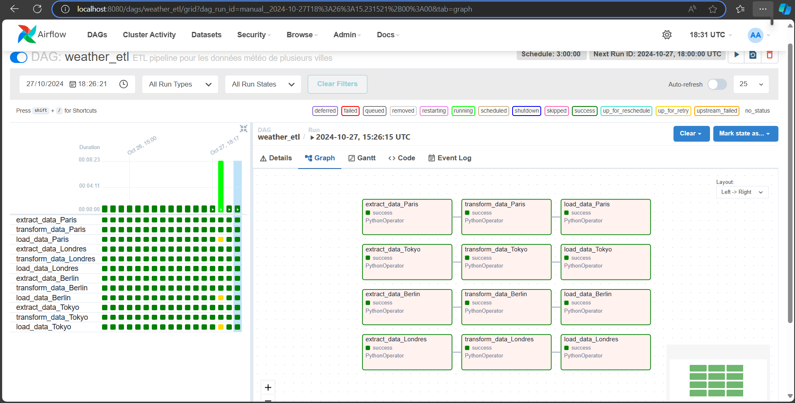

 
 # Pipeline ETL météo avec Apache Airflow

## Aperçu

Ce projet implémente un pipeline ETL (Extract, Transform, Load) pour les données météorologiques à l'aide d'Apache Airflow, Python et Docker. Le pipeline extrait les données de prévisions météorologiques de l'API OpenWeatherMap (https://openweathermap.org/api/forecast30), les transforme dans un format approprié et les charge dans une base de données PostgreSQL. Les données sont ensuite analysées et visualisées à l'aide de Jupyter Notebook (``  extract_task >> transform_task >> load_task  ``).


## Caractéristiques

- **Extraction de données** : récupère les données de prévisions météorologiques à partir de l'API OpenWeatherMap.
- **Transformation des données** : traite les données brutes dans un format structuré à l'aide de Pandas.
- **Chargement de données** : insère les données transformées dans une base de données PostgreSQL à l'aide de SQLAlchemy.
- **Analyse des données** : analyse et visualise les données à l'aide de Jupyter Notebook.
- **Environnement Dockerisé** : utilise Docker pour gérer l'environnement, garantissant ainsi la cohérence et la facilité de déploiement.

## Prérequis

- Docker et Docker Compose installés sur votre machine.
- Python 3.x installé sur votre machine.
- Une clé API OpenWeatherMap.

## Installation

1. Clonez le référentiel :
 ```bash
 git clone https://github.com/your-username/weather-etl-pipeline.git
 cd météo-etl-pipeline
 ```

2. Créez un fichier `.env` ou remplacez `.env copy` par `.enc` dans le répertoire racine avec votre clé API OpenWeatherMap :
 ```environ.
 OPENWEATHERMAP_API_KEY=votre_api_key_ici
 ```

3. Installation des dépendances : Pour installer les dépendances listées dans le fichier `requirements.txt`, exécutez la commande suivante dans votre terminal :

   ```bash
   pip install -r requirements.txt

4. Créez et démarrez les conteneurs Docker :
 ```bash
 docker-compose up --build
 ```

5. Accédez à l'interface Web Airflow à l'adresse « http://localhost:8080 ».

## Utilisation
- Par défaut les données météologiques des villes suivantes ont été utilisées, il s'agit de :
    'Paris', 'Londres', 'Berlin', 'Tokyo'
- J'ai configuré le DAG pour qu'il s'exécute toutes les 3 heures parceque l'API OpenWeatherMap fournit des prévisions météorologiques sur 5 jours avec un pas de 3 heures. [voir doc](https://openweathermap.org/api/forecast30)
- La clé API est laissé publique parcequ'il est gratuit.


1. **Activez le DAG** :
 - Accédez à l'interface Web Airflow.
 - Trouvez le DAG `weather_etl` et activez-le.
 - Déclenchez le DAG manuellement pour démarrer le processus ETL.

2. **Analyser les données** :
 - Ouvrez un notebook/main.ipynb Jupyter.
 - Connectez-vous à la base de données PostgreSQL en utilisant les informations d'identification fournies.
 - Utilisez l'exemple de bloc-notes pour interroger les données et créer des visualisations.

 - Données de connexion `` admin/admin ``
    ```
    airflow db init && airflow users create \  
        --username admin \  
        --firstname Admin \  
        --lastname Augustin \  
        --role Admin \  
        --email augustin@admin.com \  
        --password admin  
    ```
 - Assurez vous d'avoir renseigner la clé API dans le fichier .env à la racine du projet

   <b>Info </b>: Cette commande vous permet de définir une variable 'weather_api_key' Airflow sans passer par l'interface web.
        ```
        airflow variables set weather_api_key ${OPENWEATHERMAP_API_KEY}" 
        ```
 - Capture WebUI
 

## Structure du répertoire

```
/
├── dags/
│ └── weather_etl.py
├── docker-compose.yml
├── .env
├── readme.md
├── requirements.txt
└── notebook/
 └── main.ipynb
```

## Détails du DAG

Le DAG `weather_etl.py` se compose de trois tâches principales :

1. **Extraire les données** :
 - Récupère les données de prévisions météorologiques de l'API OpenWeatherMap.
 - Utilise la bibliothèque `requests` pour effectuer l'appel API.
 - Gère les erreurs d'API et réessaye si nécessaire.

2. **Transformer les données** :
 - Traite les données brutes JSON dans un format structuré à l'aide de Pandas.
 - Extrait les champs pertinents tels que la température, l'humidité et la description météorologique.
 - Convertit les données en DataFrame.

3. **Charger les données** :
 - Insère les données transformées dans une base de données PostgreSQL à l'aide de SQLAlchemy.
 - Remplace les données existantes dans la table « weather ».

## Analyse des données

Le notebook `main.ipynb` fournit des exemples sur la façon d'interroger les données de la base de données PostgreSQL et de créer des visualisations à l'aide de Matplotlib et Seaborn. ça comprend :

- Tracé linéaire de la température au fil du temps.
- Graphique à barres de l'humidité au fil du temps.
- Nuage de points de la température par rapport à humidité.
- Diagramme circulaire des descriptions météorologiques.

## Configuration du Docker

Le fichier `docker-compose.yml` définit les services requis pour le pipeline ETL :

- **PostgreSQL** : le service de sytème de gestion de base de données.
- **Airflow Init** : initialise la base de données Airflow et crée un utilisateur.
- **Serveur Web Airflow** : l'interface Web Airflow.
- **Airflow Scheduler** : le service de planification Airflow.

    NB: Chaque service se redémarre en cas d'échec.
 


## Documentation API

Pour plus d'informations sur l'API OpenWeatherMap, veuillez vous référer à la [documentation officielle](https://openweathermap.org/api/forecast30).

## Réaliser par :
  [Augustin Affognon](https://github.com/affog7)